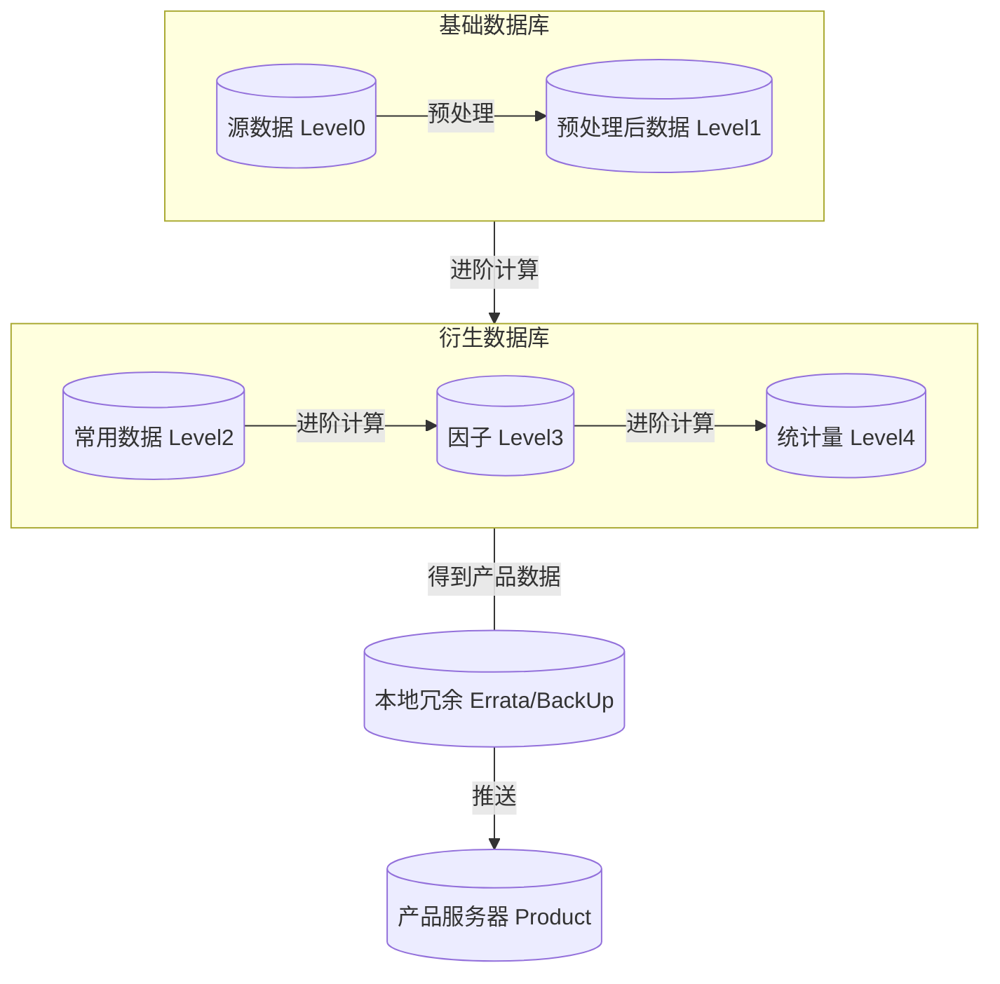

# Tour Guide

## 主线：level0

### 内容

**1. 参考 `level0`代码**

**2. 参考 `level0`数据库**

**4. 参考[SVC实现指南](https://zhuanlan.zhihu.com/p/373864501)**

**5. 使用[国泰安数据库](https://data.csmar.com/)**

**6. 实现所需的 i. 存量数据 ii. 日度增量数据 入库**

- 股票交易量（注意，实际只需要使用月度，但建议入库日度数据，以免后来的新研究重复造轮子）
- 资产负债表（总资产、净资产、归母所有者权益等）
- 利润表（扣非净利润）
- 现金流量表（期初现金及等价物，期末现金及等价物，当期现金及等价物变动

## 主线：level1

`level1` 的思路是整合数据源与数据预处理

`level1` 的任务：对`level0`新入库的数据进行处理

为此，提供以下几种处理方法，但处理方法不限于以下举例

参考`level1`数据库理解以下举例

**1. 统一 `level0`中意义类似 `结束日期`的字段，命名为 `Date`，并将数据类型设为时间格式**

**2. 统一 `level0`中意义类似 `标的`的字段，基金命名为 `Symbol`、股票命名为 `Stkcd`，并设置合理的数据类型（如果可以，使用整型数）**

**3. 将 `level0`中含义不明的列，如 `csmar.FS_Comscfi.D000103000`，参考国泰安对中文缩写成英文的大体感觉，来缩写成对应英文**

**4. 合理处理缺失值，灵活选择前值填充或删除数据的方法**

例如，

|      | Data  |          |          |          |          |          |
| ---- | ----- | -------- | -------- | -------- | -------- | -------- |
|Method| Date  | Feature1 | Feature2 | Feature3 | Feature4 | Feature5 |
|      | 1-Jan | 1        | 1        | 1        | 1        | 1        |
| Fill | 2-Jan | 1        | 1        | 1        | NA       | 1        |
|      | 3-Jan | 1        | 1        | 1        | 1        | 1        |
|      | 4-Jan | 1        | 1        | 1        | 1        | 1        |
|      | …    |          |          |          |          |          |
|      |       |          |          |          |          |          |
|      | Date  |          |          |          |          |          |
|      |       | Feature1 | Feature2 | Feature3 | Feature4 | Feature5 |
|      | 1-Jan | 1        | 1        | 1        | 1        | 1        |
| Del  | 2-Jan | 1        | NA       | NA       | NA       | NA       |
|      | 3-Jan | 1        | 1        | 1        | 1        | 1        |
|      | 4-Jan | 1        | 1        | 1        | 1        | 1        |
|      | …    |          |          |          |          |          |

实际情况比以上例子复杂，1000个人有1000种处理方式，遇到时灵活处理即可

**5. 合理处理时间频率，当发现某些时间频率不太适合做研究时，可将高频数据降频至低频；或使用填充将低频填充至高频**

例如，月度数据可轻易降频至季度频

而季度频率数据提升频率到月频较难，一般采用前值填充，更精确的填充可参考 Missing Financial Data(Bryzgalova, 2022)

**6. 合理确定数据的索引**

一般情况下，金融数据至少包含两个索引：时间——标的

在特殊情况下，例如基金的费率，还会多出另一个“费率类型”的索引

合理确定数据索引以达到该表中，索引是有经济学含义的，并可依此确定唯一的（多列）值

**7. 数据的存量脚本与增量脚本应并存，且可自动识别并运行得到期望的结果**

i) 当数据库中没有这个数据时，运行该脚本可以初始化数据库并全量入库

ii) 当数据库中有这个数据时，运行该脚本可以识别发现应为增量入库，且该情况下要求脚本运行时间极短

## 主线：level2

`level2` 的思路是让数据开箱即用

`level2` 的任务：如果发现新入库的某些数据使用频率极高，或计算方法复杂，那么为了避免以后重复造轮子，就可以把这些数据先在`level2`里存好，之后直接调用即可

参考`level2`数据库现在所存储内容即可

另外，注意数据存量脚本与增量脚本并存，且可自动识别并运行得到期望的结果

## 主线：level3

`level3` 的任务：计算因子

`level3` 因子版本1：`level3` 中的 `basic、advanced` 函数，具体计算方法参考 `mind_mapping/thesis` 论文《公募基金管理是否有效》

`level3` 因子版本2：`level3` 中的 `fundamental_stock_factors、Stock_to_Fund、fundamental_fund_factors` 函数，具体计算方法参考 `mind_mapping/thesis` 论文《Machine-learning the skill of mutual fund managers》，主要思路为先计算部分股票因子，再按照基金持仓比加权为基金因子。

❗️版本2因子计算时间较长，csmar官网每日6～7点更新数据，系统脚本每日7点运行并保证9点前结束，因此这部分因子每月运行一次即可

## 主线：level4

`level4` 的任务：根据因子得分( `z-score` )选择风险基金，另有债券基金、货币基金，具体方法参考代码，有效前沿配置投资组合比例

`2024-02-01`：`level4 ipca` 版本试运行，思路为利用因子版本1和因子版本2每月初训练一次模型，代替 `z-score` 选基，静候佳音

## 主线：level_statistics

`level_statistics` 的任务1：`level4` 数据库为FOF月报相关数据

`level_statistics` 的任务2：`product_fund` 数据库私募排排周报月报相关数据

## 主线：errata

`errata` 的任务：`product` 的备份冗余

## 主线：product

`product` 的任务：将 `level4` 每月生成的下月推荐基金，推送至 `product` 服务器

## 主线：factors_check

`factors_check` 的任务：针对 `level3` 的因子回测代码，构建 long-short 组合，计算思路见代码，参考《公募基金管理是否有效》表3

## 主线：实用命令

`crontab` ：定时执行

`screen` ：虚拟终端，offline 执行必备

---

## TODO

- IPCA 回测：`factors_check` 文件夹，后续可能因此改变 `level4` 选基金标准 ✅ Done
- 优化因子版本2：部分因子计算时间过长，如 `Idiovol`，其实每次仅当月数据改变，只需计算当月数据即可，但目前每次都计算全部历史数据 🆘 急
- 替换数据库：建议早日替换 `mysql`，存取时间过长，备选 `influxdb` 或 `clickhouse`（需要tsinghua server权限）🆘 最近测试了 `dolphindb`，不建议使用，`python API` 不全